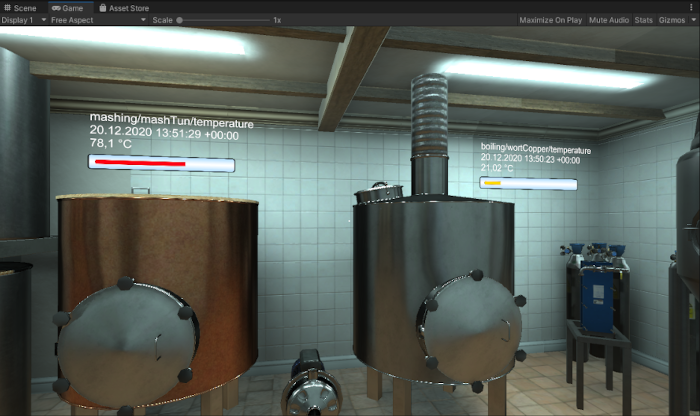

# Gemini Plugin

The Gemini package is a framework for the creation of Digital Twins in Unity.

It provides a built in custom editor window, which guides the user through the process of creating their own Digital Twin.
Configuration of network protocols are made uncomplicated and basic support for MQTT is provided.
Furthermore, we allow the user to easily configure sensors of a real device as inputs of the Digital Twin.
We provide and generate basic prefabs, that can be used to visualize and simulate the data received from the device in real time.
Custom forms of visualization like animations can be incorporated individually by the user, including more advanced replay behaviour.

An example of a brewery DT replaying recorded sensor data of the brewing process.

## Requirements

**Platform:** Unity (recommended version: 2020.1.17f1 or newer)

**Supported network protocols**: MQTT

**Message format**: JSON

**Unity package**: jilleJr Newtonsoft package

Simply open the Unity package manager through **Window > Package Manager**. Then click on **+** to add a package from this Git URL: https://github.com/jilleJr/Newtonsoft.Json-for-Unity.git#upm

## Usage

Download the [Gemini package](https://github.com/ManuelPozor/Gemini/releases/download/v1.0.0/Gemini.unitypackage) and import it into a Unity project.

Load the pre-configured example scene from ***Scenes/GEMINI Digital Twin*** or start working in your own scene immediately.
The example scene shows a single, already configured sensor.
For testing the local MQTT connection (requires MQTT running), ***Gemini Editor > Tools*** provides a simple command interface to play around with messages.

Adding Gemini to an existing scene can be done by simply importing the ***GeminiFramework/Prefabs/Settings*** prefab to your hierarchy. Then launch the plugin from the ***Gemini Editor > Run*** menu entry.
The wizard will take you step by step through the process of configuring the basics of your Digital Twin implementation.

For more detailed instructions check out the accompanying [user guide](https://github.com/ManuelPozor/Gemini/files/6617349/User.Guide.pdf).
